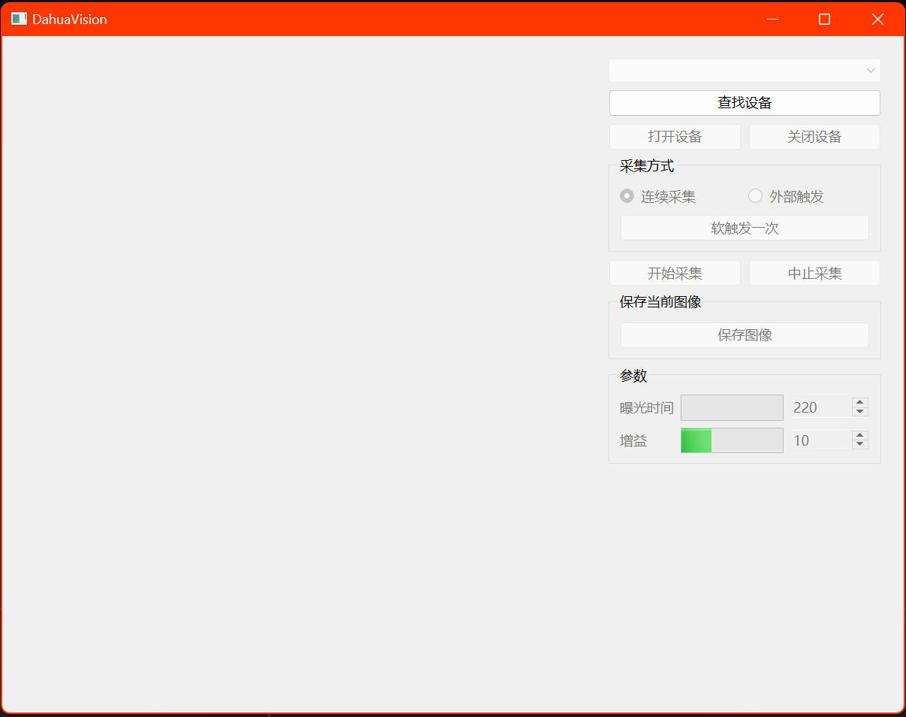

# DahuaVision_vs

参考华睿科技的demo，在Visual Studio使用Qt工具作SDK二次开发

+ 测试机型：大华 A3A20MG8

+ 开发环境：windows x86; Qt 6.5.3_msvc2019_64

+ 功能：查找设备、连接和断开设备、以外部触发或连续采集的方式进行采集、采集过程中窗口的左下角将显示帧数，帧率和码率、中断采集、软触发一次、保存为JPG或BMP格式图片、设置曝光时间和设置增益。

